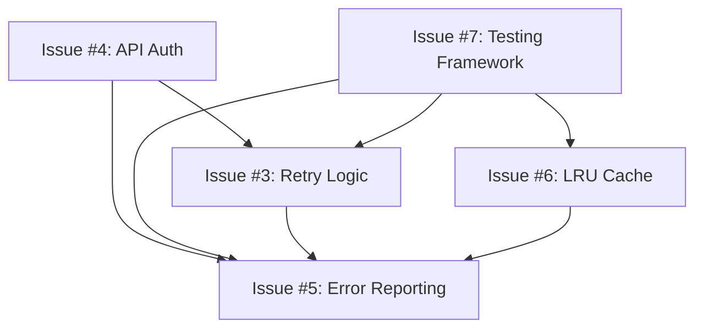

# 🚀 Post-Release Roadmap - RFE Summary

This document summarizes all Request for Enhancement (RFE) issues filed for the Stinger Chrome Extension post-release roadmap.

## 📋 **Filed RFEs Overview**

| Issue # | Title | Priority | Effort | Category |
|---------|-------|----------|--------|----------|
| [#3](https://github.com/virtualsteve-star/stinger-plugin/issues/3) | Implement comprehensive retry logic with exponential backoff | Medium | 2-3 days | Reliability |
| [#4](https://github.com/virtualsteve-star/stinger-plugin/issues/4) | Implement API authentication and authorization | High | 5-7 days | Security |
| [#5](https://github.com/virtualsteve-star/stinger-plugin/issues/5) | Enhanced error reporting and monitoring system | Medium | 4-5 days | Observability |
| [#6](https://github.com/virtualsteve-star/stinger-plugin/issues/6) | Implement LRU cache eviction policy | Medium | 3-4 days | Performance |
| [#7](https://github.com/virtualsteve-star/stinger-plugin/issues/7) | Comprehensive integration testing framework | High | 7-10 days | Quality |

## 🔴 **High Priority RFEs**

### Issue #4: API Authentication and Authorization
**Why High Priority**: Critical for production security
- Secure API communications with authentication
- JWT token management and refresh
- Authorization checks and user validation
- Backend coordination required

### Issue #7: Comprehensive Integration Testing Framework
**Why High Priority**: Essential for maintaining quality and preventing regressions
- End-to-end user workflow testing
- Chrome extension lifecycle testing
- Automated regression detection
- CI/CD integration for reliable releases

## 🟡 **Medium Priority RFEs**

### Issue #3: Comprehensive Retry Logic with Exponential Backoff
**Benefits**: Improved reliability during network issues
- Exponential backoff with jitter
- Circuit breaker pattern
- Smart error categorization
- Enhanced user experience during outages

### Issue #5: Enhanced Error Reporting and Monitoring System
**Benefits**: Better observability and debugging
- Structured error reporting
- Performance metrics dashboard
- User-friendly error messages
- Proactive error detection

### Issue #6: LRU Cache Eviction Policy
**Benefits**: Prevents memory issues and improves performance
- Bounded memory usage
- Better cache efficiency
- Multi-level caching strategy
- Cache performance analytics

## 📅 **Implementation Order**

### Phase 1: Foundation (Sprint 1)
1. **Issue #4: API Authentication** (5-7 days)
   - Critical security requirement
   - Requires backend coordination

### Phase 2: Quality & Reliability (Sprint 2)  
2. **Issue #7: Integration Testing Framework** (7-10 days)
   - Enables safe implementation of other features
   - Prevents regressions during development
   - Essential for maintaining quality

### Phase 3: Performance & Observability (Sprint 3)
3. **Issue #3: Retry Logic** (2-3 days)
4. **Issue #6: LRU Cache** (3-4 days)
5. **Issue #5: Error Reporting** (4-5 days)

## 🔗 **RFE Dependencies**

**Key Dependencies:**
- **API Auth (#4)** should be implemented first as it affects retry logic and error reporting
- **Testing Framework (#7)** enables safe implementation of other features
- **Error Reporting (#5)** benefits from metrics from all other systems

## 📊 **Effort Estimation Summary**

| Category | Total Effort | Features |
|----------|--------------|----------|
| **Security** | 5-7 days | API Authentication |
| **Quality** | 7-10 days | Integration Testing |
| **Reliability** | 2-3 days | Retry Logic |
| **Performance** | 3-4 days | LRU Cache |
| **Observability** | 4-5 days | Error Reporting |
| **TOTAL** | **21-29 days** | **5 major features** |

## 🎯 **Success Metrics**

### Security (Issue #4)
- [ ] 100% of API calls authenticated
- [ ] Zero credential exposure incidents
- [ ] Seamless token refresh experience

### Quality (Issue #7)  
- [ ] 95%+ integration test coverage
- [ ] Zero regression incidents post-implementation
- [ ] <10 minute test execution time

### Reliability (Issue #3)
- [ ] 95%+ API success rate during network issues
- [ ] <1% user-visible errors during outages
- [ ] Circuit breaker prevents cascading failures

### Performance (Issue #6)
- [ ] Bounded memory usage under all conditions
- [ ] 95%+ cache hit rate for API responses
- [ ] Sub-1ms cache access time

### Observability (Issue #5)
- [ ] 90% reduction in debugging time
- [ ] Proactive error detection and recovery
- [ ] Clear, actionable user error messages

## 📝 **Implementation Notes**

### Breaking Changes
- **Issue #4**: Authentication may require user re-setup
- **Issue #6**: Cache API may change slightly
- **Issue #7**: Test infrastructure changes

### Backend Coordination Required
- **Issue #4**: API authentication endpoints needed
- **Issue #3**: Error response standardization helpful

### User Experience Impact
- **Issue #4**: Initial setup flow for authentication
- **Issue #5**: Improved error messages and status indicators
- **Issue #3**: Better reliability during network issues

## 🔍 **Next Steps**

1. **Review and Prioritize**: Stakeholder review of RFE priorities
2. **Backend Coordination**: Align on API authentication requirements (Issue #4)
3. **Sprint Planning**: Break down high-priority RFEs into implementable tasks
4. **Resource Allocation**: Assign developers based on expertise areas
5. **Implementation**: Begin with Issue #4 (API Auth) as foundation

---

**Total RFEs Filed**: 5  
**Total Estimated Effort**: 21-29 days  
**Critical Path**: API Auth → Testing Framework → Performance Features  
**Current Priority**: Issue #4 (API Authentication and Authorization)